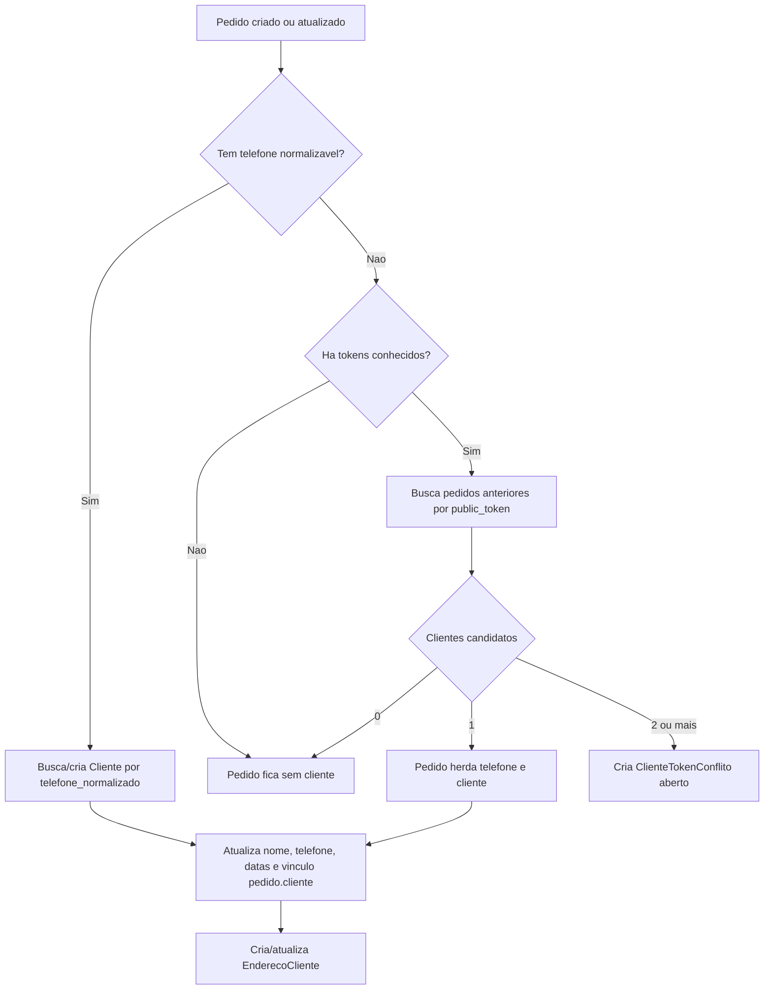

# Clientes

Este documento descreve como a área de clientes funciona no projeto, como os registros são criados, como pedidos são vinculados por telefone, como o histórico por token entra no cruzamento de dados e como conflitos são tratados.

## Visão Geral

A base de clientes é derivada dos pedidos.

O usuário não cria cliente manualmente no fluxo principal. Quando um pedido é salvo ou atualizado, o backend tenta sincronizar esse pedido com um registro em `Cliente`. A chave principal para esse vínculo é o telefone normalizado.

Quando o pedido não tem telefone, o sistema tenta aproveitar tokens de pedidos anteriores do mesmo navegador para inferir o cliente. Se essa inferência for ambígua, é criado um conflito para revisão operacional.

## Models Envolvidos

### Cliente

Model: `pedidos.models.Cliente`

Campos principais:

| Campo | Função |
| --- | --- |
| `telefone_normalizado` | Chave única do cliente. Contém somente dígitos, sem DDI `55` quando aplicável. |
| `telefone` | Telefone preservado em formato mais próximo do informado no pedido. |
| `nome` | Nome consolidado do cliente. |
| `nome_editado_manualmente` | Impede sobrescrita automática do nome quando alguém ajusta manualmente o perfil. |
| `primeiro_pedido_em` | Menor data de pedido vinculada ao cliente. |
| `ultimo_pedido_em` | Maior data de pedido vinculada ao cliente. |
| `criado_em` | Data de criação do cliente. |
| `atualizado_em` | Data da última atualização do cliente. |

Ordenação padrão:

```text
-ultimo_pedido_em, nome
```

### Pedido

Model: `pedidos.models.Pedido`

O pedido possui:

```python
cliente = models.ForeignKey(Cliente, on_delete=models.SET_NULL, null=True, blank=True, related_name="pedidos")
```

Isso significa:

- um cliente pode ter muitos pedidos;
- um pedido pode não ter cliente vinculado;
- se um cliente for removido, o pedido permanece, mas `pedido.cliente` vira `NULL`.

### EnderecoCliente

Model: `pedidos.models.EnderecoCliente`

Endereços usados por clientes são salvos separadamente a partir dos dados do pedido.

Campos principais:

| Campo | Função |
| --- | --- |
| `cliente` | Cliente dono do endereço. |
| `endereco` | Endereço completo salvo no pedido. |
| `endereco_formatado` | Endereço formatado. |
| `rua`, `numero_endereco`, `bairro`, `cidade`, `estado` | Partes estruturadas do endereço. |
| `complemento`, `lote_quadra`, `ponto_referencia` | Detalhes adicionais. |
| `latitude`, `longitude` | Coordenadas, quando existirem. |
| `primeiro_uso_em` | Primeiro pedido que usou esse endereço. |
| `ultimo_uso_em` | Último pedido que usou esse endereço. |
| `ultimo_pedido` | Último pedido associado ao endereço. |

Há uma restrição de unicidade por:

```text
cliente + endereco + complemento + lote_quadra + ponto_referencia
```

Ou seja, o mesmo cliente pode ter mais de um endereço salvo, e diferenças em complemento, lote/quadra ou referência são tratadas como endereços distintos.

### ClienteTokenConflito

Model: `pedidos.models.ClienteTokenConflito`

Usado quando um pedido sem telefone encontra mais de um possível cliente pelos tokens conhecidos.

Campos principais:

| Campo | Função |
| --- | --- |
| `pedido` | Pedido que gerou o conflito. |
| `tokens` | Lista de tokens usados na tentativa de inferência. |
| `clientes` | Clientes candidatos encontrados. |
| `status` | `aberto` ou `resolvido`. |
| `criado_em` | Data de criação. |
| `atualizado_em` | Última atualização. |

Atualmente a tela lista conflitos abertos para análise, mas a resolução automática/manual formal do conflito ainda não altera o `status` no fluxo mostrado.

## Normalização de Telefone

Função: `pedidos.order_services.normalize_phone`

Regra atual:

1. Remove tudo que não for dígito.
2. Se o resultado tiver mais de 11 dígitos e começar com `55`, remove o prefixo `55`.
3. Retorna a sequência final de dígitos.

Exemplos:

| Entrada | Saída |
| --- | --- |
| `(64) 99999-0000` | `64999990000` |
| `64 99999-0000` | `64999990000` |
| `5564999990000` | `64999990000` |

Essa saída alimenta `Cliente.telefone_normalizado`, que é único no banco.

## Criação e Sincronização de Cliente

Função principal:

```python
sync_customer_from_order(pedido)
```

Essa função é a fonte central de criação e atualização de clientes a partir de pedidos.

### Quando não cria cliente

A função retorna `None` e não cria cliente quando:

- o pedido não tem telefone normalizável;
- o pedido está com status `rascunho`.

Se o pedido não tem telefone, mas estava vinculado a um cliente, o vínculo é removido:

```python
pedido.cliente = None
pedido.save(update_fields=["cliente"])
```

### Quando cria ou reutiliza cliente

Quando existe telefone normalizado, o sistema faz:

```python
Cliente.objects.get_or_create(telefone_normalizado=telefone_normalizado)
```

Se não existir cliente com aquele telefone normalizado, cria um novo com:

- `telefone`;
- `nome`;
- `primeiro_pedido_em`;
- `ultimo_pedido_em`.

Se já existir, reutiliza o cliente.

### Atualização de telefone

Se o telefone textual do pedido estiver preenchido e diferente de `cliente.telefone`, o cliente recebe o telefone do pedido.

O identificador real de deduplicação continua sendo `telefone_normalizado`.

### Atualização de nome

O nome do cliente pode ser atualizado automaticamente a partir do pedido, com uma proteção importante.

O sistema considera como nomes placeholder:

```text
"" ou "cliente"
```

Se o pedido tem nome real e o cliente não foi editado manualmente, o nome do cliente pode ser atualizado.

Se `cliente.nome_editado_manualmente=True`, a sincronização não sobrescreve o nome do cliente.

### Herança de nome para pedido placeholder

Se o pedido chega com nome placeholder, mas o cliente já tem nome conhecido, o pedido herda o nome do cliente.

Exemplo:

1. Cliente já existe como `Beth`.
2. Novo pedido vem com telefone igual e nome `Cliente`.
3. O pedido é vinculado ao cliente.
4. O pedido passa a ter `nome_cliente = "Beth"`.

### Datas de primeiro e último pedido

Ao sincronizar:

- `primeiro_pedido_em` é atualizado se o pedido for mais antigo que o valor atual;
- `ultimo_pedido_em` é atualizado se o pedido for mais recente que o valor atual.

## Sincronização de Endereços

Dentro de `sync_customer_from_order`, se `pedido.endereco` estiver preenchido, o sistema cria ou atualiza um `EnderecoCliente`.

A busca usa:

```text
cliente
endereco
complemento
lote_quadra
ponto_referencia
```

Os valores copiados do pedido incluem:

- `endereco_formatado`;
- `rua`;
- `numero_endereco`;
- `bairro`;
- `cidade`;
- `estado`;
- `latitude`;
- `longitude`;
- `primeiro_uso_em`;
- `ultimo_uso_em`;
- `ultimo_pedido`.

Se o endereço já existe e algum desses campos mudou, o registro é atualizado.

## Tokens de Pedido e Histórico do Navegador

Cada pedido possui `public_token`, gerado automaticamente no `Pedido.save`.

Esse token é usado em fluxos públicos, como:

- página de sucesso;
- acompanhamento do pedido;
- listagem pública de “meus pedidos”.

Cookie usado:

```text
prato_delivery_orders
```

Constantes:

```python
ORDER_HISTORY_COOKIE = "prato_delivery_orders"
ORDER_HISTORY_COOKIE_MAX_AGE = 60 * 60 * 24 * 180
```

Ou seja, o histórico fica salvo por aproximadamente 180 dias.

Após o sucesso de um pedido, o sistema grava no cookie:

```json
[
  {
    "token": "token-do-pedido-atual",
    "numero": 2240
  },
  {
    "token": "token-anterior"
  }
]
```

O histórico é limitado a 30 tokens.

## Coleta de Tokens Conhecidos

Função:

```python
_known_order_tokens_from_request(request)
```

Ela coleta tokens de duas fontes:

1. `request.POST["known_order_tokens"]`;
2. cookie `prato_delivery_orders`.

Os tokens são deduplicados e limitados a 30.

A função aceita payloads em formatos usados pelo frontend, incluindo listas de strings ou listas de objetos com chave `token`.

## Herança de Cliente por Token

Função principal:

```python
inherit_customer_from_known_tokens(pedido, tokens)
```

Essa função tenta vincular um pedido sem telefone a um cliente já conhecido pelo histórico de tokens.

### Regra de prioridade

Se o pedido já tem telefone, já tem cliente, ou é rascunho, a função não usa tokens. Ela chama diretamente:

```python
sync_customer_from_order(pedido)
```

Isso mantém o telefone como fonte mais forte que o histórico do navegador.

### Pedido sem telefone

Quando o pedido não tem telefone e não tem cliente:

1. Normaliza a lista de tokens.
2. Busca pedidos anteriores com `public_token` nessa lista.
3. Para cada pedido encontrado:
   - usa `pedido.cliente`, se já existir;
   - se não existir cliente, mas houver telefone no pedido anterior, chama `sync_customer_from_order` nesse pedido anterior.
4. Monta a lista de clientes candidatos.

### Exatamente um cliente candidato

Se apenas um cliente for encontrado:

1. O pedido atual herda `telefone` desse cliente.
2. O pedido atual recebe `cliente`.
3. O pedido é salvo.
4. `sync_customer_from_order(pedido)` roda novamente para consolidar nome, datas e endereço.

Resultado: o pedido sem telefone passa a fazer parte do mesmo perfil de cliente.

### Mais de um cliente candidato

Se mais de um cliente for encontrado:

1. O pedido não é vinculado automaticamente.
2. É criado um `ClienteTokenConflito`.
3. O conflito guarda:
   - pedido;
   - tokens usados;
   - clientes candidatos.

Isso evita vincular automaticamente um pedido ao cliente errado quando o navegador tem histórico de mais de uma pessoa.

### Nenhum cliente candidato

Se nenhum cliente for encontrado pelos tokens, a função retorna `None` e o pedido fica sem cliente.

## Onde a Sincronização é Chamada

### Checkout de entrega

View:

```python
criar_pedido(request)
```

Depois de criar o pedido, itens e totais, chama:

```python
inherit_customer_from_known_tokens(pedido, _known_order_tokens_from_request(request))
```

### Retirada

View:

```python
criar_retirada(request)
```

Também chama `inherit_customer_from_known_tokens` depois de salvar pedido, itens e totais.

Como retirada pode não ter telefone, o token é especialmente importante nesse fluxo.

### Edição administrativa de pedido

Em pontos de atualização administrativa de pedido, o projeto chama `sync_customer_from_order(pedido)` após alterar dados que podem afetar cliente ou endereço.

Isso mantém o perfil do cliente alinhado quando equipe interna corrige:

- nome;
- telefone;
- endereço;
- tipo de coleta;
- dados de entrega.

## Telas Internas de Clientes

### Lista de Clientes

URL:

```text
/controle/clientes/
```

View:

```python
clientes_admin(request)
```

Proteção:

```python
@staff_member_required(login_url="/admin/login/")
```

A lista mostra apenas clientes com pelo menos um pedido vinculado:

```python
Cliente.objects.annotate(pedidos_count=Count("pedidos")).filter(pedidos_count__gt=0)
```

Ordenação:

```text
-ultimo_pedido_em, nome
```

### Perfil do Cliente

URL:

```text
/controle/clientes/<cliente_id>/
```

View:

```python
cliente_detalhe_admin(request, cliente_id)
```

Mostra:

- dados principais;
- telefone;
- primeiro pedido;
- último pedido;
- total de pedidos;
- tokens vinculados;
- endereços utilizados;
- histórico de pedidos.

### Edição Manual do Nome

No perfil do cliente, usuários com permissão de gerente podem editar o nome.

Quando isso acontece:

```python
cliente.nome_editado_manualmente = True
```

A partir daí, sincronizações futuras não sobrescrevem automaticamente o nome do cliente com o nome vindo de pedidos.

### Conflitos por Token

URL:

```text
/controle/clientes/conflitos/
```

View:

```python
clientes_conflitos_admin(request)
```

Mostra conflitos abertos em que um pedido sem telefone encontrou mais de um possível cliente pelo histórico de tokens.

Cada card mostra:

- pedido;
- data;
- clientes candidatos;
- link para abrir o pedido;
- link para abrir os perfis candidatos.

## Fluxo Resumido



## Regras de Integridade

- O telefone normalizado é a identidade forte do cliente.
- O token é um indício auxiliar, usado principalmente quando o pedido atual não tem telefone.
- O sistema evita vínculo automático quando os tokens apontam para múltiplos clientes.
- Pedidos rascunho não geram cliente.
- Pedido sem telefone não gera cliente por si só.
- Endereços são deduplicados por cliente, endereço e detalhes complementares.
- Nome editado manualmente tem prioridade sobre nomes vindos de pedidos futuros.

## Exemplos Práticos

### Mesmo telefone com formatação diferente

Pedidos:

```text
(64) 99999-0000
64 99999-0000
5564999990000
```

Todos normalizam para:

```text
64999990000
```

Resultado:

- um único `Cliente`;
- múltiplos `Pedido` vinculados a ele;
- endereços salvos em `EnderecoCliente`.

### Pedido de retirada sem telefone com token conhecido

1. Cliente fez um pedido anterior com telefone.
2. O navegador guardou o token desse pedido em `prato_delivery_orders`.
3. Cliente faz retirada sem informar telefone.
4. O backend encontra o pedido anterior pelo token.
5. Se ele aponta para um único cliente, o pedido novo herda o telefone e o vínculo.

### Navegador com histórico de duas pessoas

1. O cookie possui tokens de pedidos de dois clientes diferentes.
2. Novo pedido vem sem telefone.
3. O sistema encontra dois candidatos.
4. Nenhum vínculo automático é feito.
5. Um `ClienteTokenConflito` é criado para análise.

## Arquivos Relevantes

| Arquivo | Responsabilidade |
| --- | --- |
| `pedidos/models.py` | Models `Cliente`, `EnderecoCliente`, `ClienteTokenConflito` e relação `Pedido.cliente`. |
| `pedidos/order_services.py` | Normalização de telefone, criação/sincronização de cliente, herança por tokens e conflitos. |
| `pedidos/views.py` | Coleta de tokens, criação de pedidos, cookie de histórico e telas internas de clientes. |
| `templates/pedidos/clientes_admin.html` | Lista de clientes. |
| `templates/pedidos/cliente_detalhe_admin.html` | Perfil do cliente. |
| `templates/pedidos/clientes_conflitos_admin.html` | Lista de conflitos por token. |
| `pedidos/tests.py` | Testes cobrindo telefone, token, cookie, edição manual e conflitos. |

## Testes Relacionados

Os testes principais ficam em `pedidos/tests.py` e cobrem:

- reutilização de cliente por telefone normalizado;
- listagem e perfil de clientes;
- edição manual de nome;
- herança de cliente por token;
- herança de cliente por cookie;
- preservação de nome quando pedido usa placeholder;
- criação de conflito quando tokens apontam para múltiplos clientes;
- listagem de conflitos abertos.

Para rodar:

```powershell
.\.venv\Scripts\python.exe manage.py test pedidos
```
